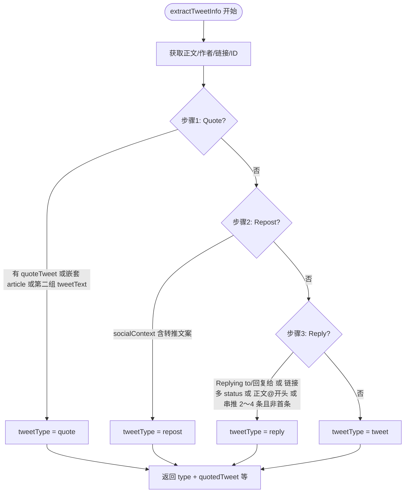
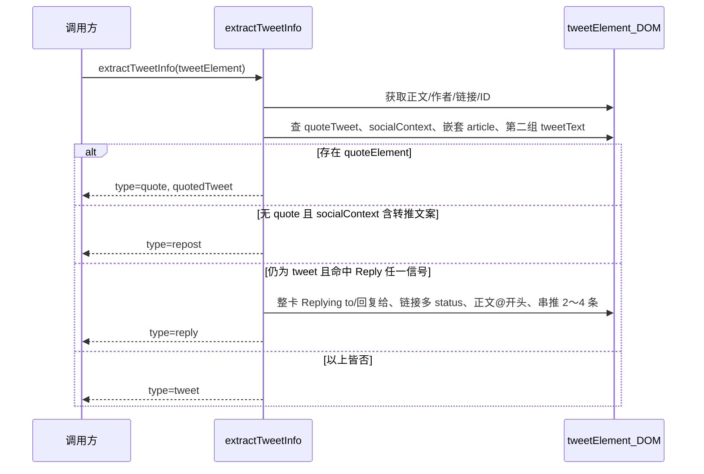
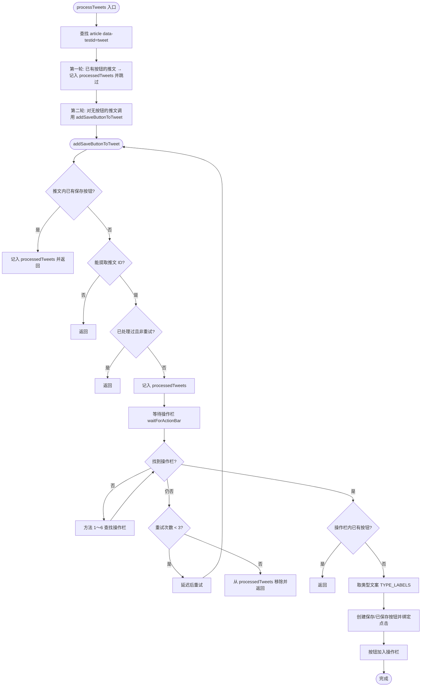
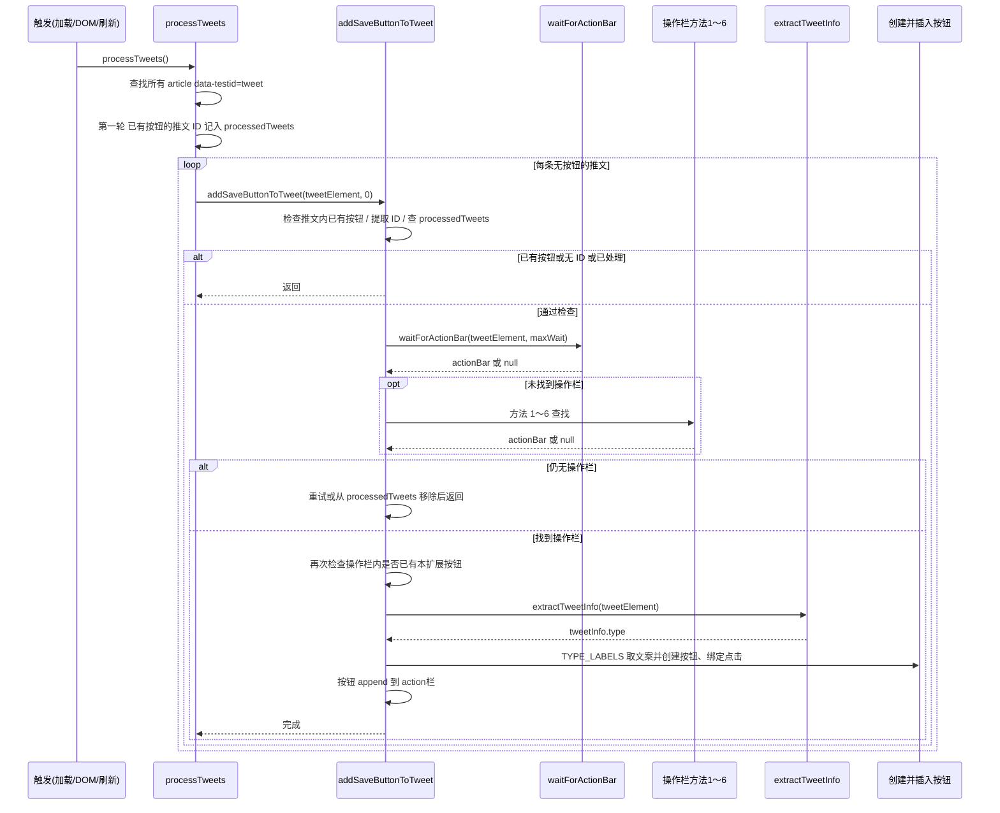

# X推文追踪器 - 逻辑说明

本文档整合扩展的两大判断逻辑：**推文类型识别**（Tweet / Reply / Repost / Quote）与 **保存按钮添加**，并与 [content.js](../content.js) 实现一致。

---

## 目录

1. [推文类型识别](#一推文类型识别)
2. [保存按钮添加](#二保存按钮添加)
3. [触发时机](#三触发时机)
4. [与代码对应](#四与代码对应)

---

## 一、推文类型识别

类型在 `extractTweetInfo(tweetElement)` 中判定，用于保存时的 `type` 字段及按钮上的类型文案（Tweet / Reply / Repost / Quote）。

### 1.1 判定顺序与优先级

按以下顺序判定，**先命中即确定**，不再后续降级：

| 顺序 | 类型 | 说明 |
|------|------|------|
| 1 | Quote | 存在引用卡片或内嵌推文块，且非「纯转推」上下文 |
| 2 | Repost | 存在转推语义的 socialContext |
| 3 | Reply | 存在「Replying to/回复」文案、或链接多 status、或正文 @ 开头、或结构上为串推非首条 |
| 4 | Tweet | 以上均不满足时的默认 |

### 1.2 类型判定流程图（Mermaid）

### 1.2.1 类型判定时序图（Mermaid）

### 1.3 各类型判据摘要

**Quote（引用）**

- **主**：`[data-testid="quoteTweet"]` 存在。
- **备选 1**：当前 article 内存在嵌套的 `article[data-testid="tweet"]`（用 `tweetElement.contains(nested)` 判断），且无「转推」socialContext。
- **备选 2**：同条内存在至少 2 个 `[data-testid="tweetText"]`，取第二个所在容器（如 `div[role="link"]`）作为引用块。

**Repost（转推）**

- **主**：`[data-testid="socialContext"]` 的文本匹配 `/转推|Reposted|转推了|reposted|Retweeted/i`。

**Reply（回复）**

- **主**：只匹配**回复语境**的完整短语，避免命中操作栏的「回复」/「Reply」按钮（每条推文都有）。整卡用正则 `/Replying\s+to|回复给/i`（不匹配单字「回复」或 "Reply"）；若不中再在 `span,a,div` 中查找「Replying to」或「回复给」。
- **备选 1**：推文链接中匹配到多个 `/status/(\d+)/`。
- **备选 2**：正文 trim 后匹配 `^@\w+\s+`（仅辅助）。
- **备选 3（结构）**：从当前 article 的 parent 向上遍历（最多 25 层），对每个祖先取「顶层」article，**仅当数量在 2～4**（典型对话/串推）且当前条不是该组首条时判为 reply；2～15 会误把整页时间线当一串，已收紧为 2～4。

**Tweet（普通推文）**

- 以上均未命中则默认为 tweet。

**Reply 误判修正说明（曾导致大量普通推文被标为 Reply）**

1. **文案过宽**：原先用 `/回复(给)?|Replying\s+to/i` 及节点内「回复」匹配。操作栏的「回复」/「Reply」按钮每条推文都有，整卡 `innerText` 会包含该词，导致全部被判为 reply。修正：只认完整回复语境——**「Replying to」**（带 to）与 **「回复给」**，不再匹配单字「回复」或 "Reply"。
2. **结构过宽**：原先祖先内顶层 article 数 2～15 且当前非首条即判 reply。时间线容器内可见推文常为 2～15 条，故非首条都被误判。修正：仅当该数量为 **2～4**（典型对话/串推）时才按结构判 reply。

### 1.4 信号与代码位置

| 信号/实现 | 选择器或方式 | 类型 | 说明 |
|-----------|--------------|------|------|
| quoteTweet | `querySelector('[data-testid="quoteTweet"]')` | quote | 高 |
| 嵌套 article | `querySelectorAll('article[data-testid="tweet"]')` 且 `contains` 且非 repost 上下文 | quote | 中 |
| 第二组 tweetText | 第二个 `[data-testid="tweetText"]` 的容器 | quote | 中 |
| socialContext | `[data-testid="socialContext"]` 文案匹配转推 | repost | 高 |
| 整卡/节点 Replying to | 整卡正则 `/Replying\s+to|回复给/i`（不匹配单字回复/Reply），或 span/a/div 含「Replying to」「回复给」 | reply | 高 |
| 链接多 status | `tweetLink.match(/\/status\/(\d+)/g)` 长度 > 1 | reply | 中 |
| 正文 @ 开头 | `^@\w+\s+` | reply | 低、辅助 |
| 串推结构 | 自 parent 向上最多 25 层，祖先内顶层 article 数 **2～4** 且当前非首条（避免把时间线当一串） | reply | 中 |

---

## 二、保存按钮添加

按钮添加由 `processTweets()` 入口与 `addSaveButtonToTweet(tweetElement, retryCount)` 完成，确保不重复、在合适时机添加、支持动态加载。`processTweets()` 第二轮对「无按钮」的推文：若已有操作栏（`[role="group"]` 或 reply/retweet/like 存在）则立即调用 `addSaveButtonToTweet`，否则 500ms 后调用以等待动态加载。

### 2.1 核心数据结构

- **processedTweets**：`Set`，已处理过的推文 ID，用于防重与刷新时清空。
- **按钮类名**：`x-tracker-save-btn`（未保存）、`x-tracker-saved-btn`（已保存）。
- **TYPE_LABELS**：类型在按钮上的英文文案 `{ tweet: 'Tweet', reply: 'Reply', repost: 'Repost', quote: 'Quote' }`，添加前通过 `extractTweetInfo()` 取类型后取文案。

### 2.2 按钮添加流程图（Mermaid）

### 2.2.1 按钮添加时序图（Mermaid）

### 2.3 检查层次概要

| 层次 | 检查内容 | 失败时 |
|------|----------|--------|
| 1 | 推文内是否已有 `.x-tracker-save-btn` / `.x-tracker-saved-btn` | 记入 processedTweets，返回 |
| 2 | 能否从 `a[href*="/status/"]` 提取推文 ID | 返回 |
| 3 | 是否已在 processedTweets 且本次非重试 | 返回；否则记入 |
| 4 | 等待并查找操作栏（waitForActionBar + 方法 1～6） | 未找到则进入重试 |
| 5 | 重试次数 < 3 则延迟后再次调用 addSaveButtonToTweet | 否则从 processedTweets 移除并返回 |
| 6 | 操作栏内是否已有本扩展按钮 | 有则返回 |
| 7 | 调用 `extractTweetInfo()` 取类型 → TYPE_LABELS 取文案 → 创建按钮（带类型文案）、绑定点击、插入操作栏 | 完成 |

### 2.4 操作栏查找方法（与代码一致）

1. **方法 1**：`tweetElement.querySelector('[role="group"]')`
2. **方法 2**：`[data-testid="reply"]` → `closest('div[role="group"]')`；若无则沿 parent 向上最多 5 层，若 `role="group"` 或含至少 2 个 reply/retweet/like 则取该父节点
3. **方法 3**：`[data-testid="reply"], [data-testid="retweet"], [data-testid="like"], [data-testid="bookmark"], [data-testid="share"]` 找共同父容器且该父容器包含其中至少 2 个；否则向上最多 10 层
4. **方法 4**：`button, [role="button"]` 的父元素中，存在至少 3 个按钮的容器
5. **方法 5**：`button[aria-label*="回复/Reply/转推/Repost/喜欢/Like"]` 的共有祖先（向上最多 15 层），且该祖先内至少 2 个此类按钮且含互动数字或至少 3 个操作按钮
6. **方法 6**：`div[style*="display: flex"], div[class*="flex"]` 中含至少 3 个按钮且存在 reply/retweet/like 的 aria-label 或 data-testid 的容器

**waitForActionBar**：轮询上述逻辑，最大等待时间首次 1000ms、重试时 2000ms，每 100ms 重试，找到含至少 2 个操作按钮的 `[role="group"]` 即返回。

---

## 三、触发时机

- **页面加载**：`DOMContentLoaded` 后 500ms 或 `readyState` 非 loading 时 500ms 起，执行 `processWhenReady`：立即 `processTweets()`，再在 500 / 1000 / 2000 / 3000 / 5000 ms 各调用一次 `processTweets()`。
- **DOM 变化（MutationObserver）**：新增 `article[data-testid="tweet"]` 或含该元素的节点 → 500ms 后 `processTweets()`；新增或属性变化涉及 `[role="group"]`、`[data-testid="reply/retweet/like"]` 或推文 article → 1000ms 后 `processTweets()`。
- **popstate**：300ms 后 `processedTweets.clear()` 并 `processTweets()`，再在 1000ms、3000ms 各调用一次。
- **pageshow（event.persisted 为 true）**：同上，清空后 300ms / 1000ms / 3000ms 调用。
- **visibilitychange**：`document.hidden` 为 false 时，500ms 与 2000ms 后各调用一次 `processTweets()`。
- **手动刷新（悬浮窗或 popup 触发 refreshButtons）**：`forceRefreshButtons()`：`processedTweets.clear()` → 立即 `processTweets()` → 500ms、1500ms 再各调用一次。

---

## 四、与代码对应

| 功能 | 函数/位置 |
|------|-----------|
| 类型判定 | `content.js` → `extractTweetInfo()` 内步骤 1～3 及默认 tweet |
| 类型调试 | `DEBUG_TYPE_DETECTION === true` 时在控制台输出 type 与 signals |
| 按钮添加入口 | `content.js` → `processTweets()`：先遍历更新 processedTweets（已有按钮的推文），再对无按钮的推文若已有操作栏则立即 `addSaveButtonToTweet`，否则 500ms 后调用 |
| 单条添加与重试 | `content.js` → `addSaveButtonToTweet(tweetElement, retryCount)`，重试时延迟 (retryCount+1)*500ms，最多重试 3 次 |
| 操作栏等待 | `content.js` → `waitForActionBar(tweetElement, maxWait)`，maxWait 首次 1000、重试 2000 |

若 X 改版导致选择器失效，可优先调整 `extractTweetInfo` 内对应步骤与 `addSaveButtonToTweet` 内操作栏查找方式，并同步更新本文档。
